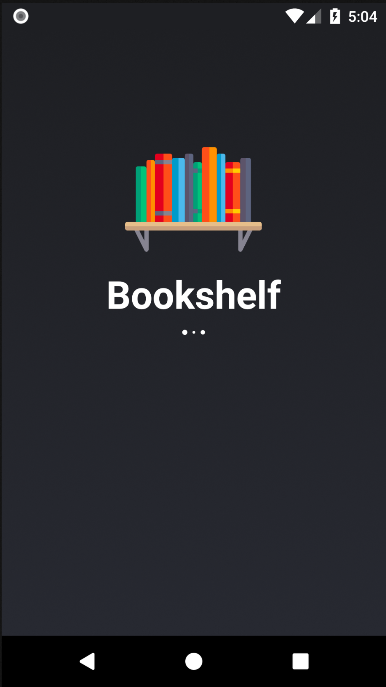
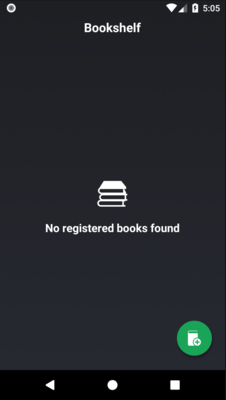
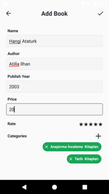
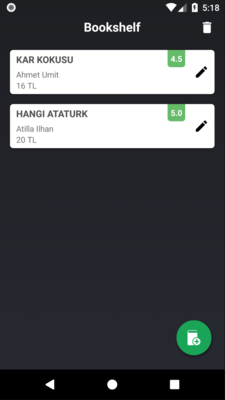

<p align="center">
  
</p>

<p align="center" style="font-size:30px">
<b>Bookshelf-App</b>
</p>

This is a sample app which I used some features.

    

Activity Transition | Multi Select
:-: | :-:
 | 


# Features
1. [MVP Design Pattern](https://github.com/ismailgungor/Bookshelf-App/#gradle-dependency)
2. [Room Database](https://github.com/ismailgungor/Bookshelf-App/#room-database)
3. [Dagger2](https://github.com/ismailgungor/Bookshelf-App/#dagger2)
4. [RxJava](https://github.com/ismailgungor/Bookshelf-App/#rxjava)
5. [Shared Element Activity Transition](https://github.com/ismailgungor/Bookshelf-App/#shared-element-activity-transition)
6. [Circular Reveal Animation](https://github.com/ismailgungor/Bookshelf-App/#circular-reveal-animation)
7. [Multi Select With Recycler View](https://github.com/ismailgungor/Bookshelf-App/#multi-select-with-recycler-view)


### MVP Design Pattern

MVP was used as design pattern in this app. You can see the sample usage below.

```kotlin
   interface SplashActivityContract {

    interface View {

        fun finishActivity()

        fun showErrorMessage()

    }

    interface Presenter {

        fun setView(view: View)

        fun created()
    }
    
    class SplashActivityPresenter @Inject constructor() : SplashActivityContract.Presenter 
    .
    .
    .
    
    class SplashActivity : AppCompatActivity(), SplashActivityContract.View 
    .
    .
    .
}
  ```
  

### Room Database
  
Room Database was used as local database in this app. You can see the sample usage below.
```kotlin
//Sample Entity (Table) class
@Entity(tableName = DatabaseKeys.CATEGORIES)
data class CategoryTable(

    @ColumnInfo(name = DatabaseKeys.CATEGORY_NAME)
    var name: String

) : Serializable {

    @PrimaryKey(autoGenerate = true)
    var categoryId: Int?= null

}

//Sample Dao class
@Dao
interface CategoryDao {

    @Query(DatabaseQueries.GET_ALL_CATEGORIES)
    fun getAllCategories(): Single<List<CategoryTable>>

    @Query(DatabaseQueries.GET_CATEGORY_COUNT)
    fun getCategoryCount(): Single<Int>

    @Insert(onConflict = OnConflictStrategy.REPLACE)
    fun insert(categoryTable: CategoryTable): Single<Long>

    @Insert(onConflict = OnConflictStrategy.REPLACE)
    fun insertAll(categoryTableList: List<CategoryTable>)

    @Update
    fun update(categoryTable: CategoryTable)

    @Delete
    fun delete(categoryTable: CategoryTable)

    @Delete
    fun deleteAll(categoryTableList: List<CategoryTable>): Completable

    @Query(DatabaseQueries.DELETE_ALL_CATEGORIES)
    fun deleteAll()

}

//Sample Database Class
@Database(entities = [CategoryTable::class, BookTable::class, CategoryBookJoinTable::class], 
          version = 1)
abstract class AppRoomDatabase : RoomDatabase() {

    abstract fun categoryDao(): CategoryDao

    abstract fun bookDao(): BookDao

    abstract fun categoryBookJoinDao(): CategoryBookJoinDao
}

//Sample code to build database
Room.databaseBuilder(
            context,
            AppRoomDatabase::class.java,
            DatabaseKeys.DATABASE_NAME
        ).build()
```


### Dagger2
Dagger2 was used for dependency injection in this app. You can see the sample usage below.
```kotlin

@Module
class AppModule(context: Context) {

    private var mContext = context

    @Provides
    fun provideContext(): Context {
        return this.mContext
    }

}

@Module
class AppRoomDatabaseModule {

    @Provides
    fun provideAppRoomDatabase(context: Context): AppRoomDatabase {
        return Room.databaseBuilder(
            context,
            AppRoomDatabase::class.java,
            DatabaseKeys.DATABASE_NAME
        ).build()
    }
}

@Singleton
@Component(
    modules = [
        (AppModule::class),
        (AppRoomDatabaseModule::class)]
)
interface SplashActivityComponent {

    fun inject(activity: SplashActivity)

}

//Splash Activity onCreate

override fun onCreate(savedInstanceState: Bundle?) {
        super.onCreate(savedInstanceState)
        setContentView(R.layout.activity_splash)

        DaggerSplashActivityComponent.builder()
            .appModule(AppModule(this))
            .appRoomDatabaseModule(AppRoomDatabaseModule())
            .build()
            .inject(this)
           
    }

```


### RxJava
RxJava was used as reactive programming approach in this app. You can see the sample usage below.

```kotlin
class CategoryDataManagement(
    categoryDao: CategoryDao
    )  {


    private val mCategoryDao = categoryDao
 
    fun getAllICategoriesFromDB(): Single<List<CategoryTable>> {
        return mCategoryDao.getAllCategories()
    }

    fun getCategoryCountFromDB(): Single<Int> {
        return mCategoryDao.getCategoryCount()
    }

    fun getAllCategoriesFromFile(): ArrayList<CategoryTable>? {

        this.mCategoryFileManager.loadStringCategoryNameArrayFromAsset()?.let {
            return this.mCategoryTypeConverter.getConvertedCategoryListFromJsonArray(it)
        }
        return null
    }

    fun <T> insertAll(itemList: List<T>): Completable? {
        return Completable.fromAction {
            mCategoryDao.insertAll(itemList as List<CategoryTable>)
        }
    }

    fun deleteAll(): Completable? {
        return Completable.fromAction {
            mCategoryDao.deleteAll()
        }
    }
}

class SplashActivityPresenter @Inject constructor() : SplashActivityContract.Presenter {

    @Inject
    lateinit var mCategoryDataManagement: CategoryDataManagement

    @SuppressLint("CheckResult")
    override fun created() {

        Handler().postDelayed({
            this.mCategoryDataManagement.getAllCategoriesFromFile()?.let { categoryListFromFile ->

                if (categoryListFromFile.isNotEmpty()) {
                    mCategoryDataManagement.getCategoryCountFromDB()
                        .subscribeOn(Schedulers.io())
                        .observeOn(AndroidSchedulers.mainThread())
                        .subscribe({
                            if (it < categoryListFromFile.size) {
                                mCategoryDataManagement.deleteAll()?.andThen(
                                    mCategoryDataManagement.insertAll(categoryListFromFile)
                                )?.subscribeOn(Schedulers.io())
                                    ?.observeOn(AndroidSchedulers.mainThread())
                                    ?.subscribe({
                                        continueWithMainActivity()

                                    }, {
                                        continueWithError()
                                    })

                            } else {
                                continueWithMainActivity()
                            }

                        }, {
                            continueWithError()
                        })
                } else
                    continueWithError()

            }
        }, 1000)


    }
.
.
.
}


```


### Shared Element Activity Transition

Shared Element Activity Transition was used between Main-Book Activity. You can see the sample usage below.

activity_main.xml
``` xml
<com.github.clans.fab.FloatingActionButton
                android:id="@+id/fab_add_book"
                android:layout_width="@dimen/fab_size_normal"
                android:layout_height="@dimen/fab_size_normal"
                android:layout_alignParentEnd="true"
                android:layout_alignParentRight="true"
                android:layout_alignParentBottom="true"
                android:layout_marginEnd="@dimen/fab_margin"
                android:layout_marginRight="@dimen/fab_margin"
                android:layout_marginBottom="@dimen/fab_margin"
                android:src="@drawable/ic_add_book"
                android:transitionName="fab"
                app:fab_colorNormal="@color/pigment_green"
                app:fab_colorPressed="@color/pigment_green"
                app:fab_progress_color="@color/spring_green"
                app:fab_showShadow="true"
                tools:ignore="UnusedAttribute"/>

```


activity_book.xml
``` xml
<com.github.clans.fab.FloatingActionButton
                android:id="@+id/fab_add_book"
                android:layout_width="@dimen/fab_size_normal"
                android:layout_height="@dimen/fab_size_normal"
                android:layout_alignParentEnd="true"
                android:layout_alignParentRight="true"
                android:layout_alignParentBottom="true"
                android:layout_marginEnd="@dimen/fab_margin"
                android:layout_marginRight="@dimen/fab_margin"
                android:layout_marginBottom="@dimen/fab_margin"
                android:src="@drawable/ic_add_book"
                android:transitionName="fab"
                app:fab_colorNormal="@color/pigment_green"
                app:fab_colorPressed="@color/pigment_green"
                app:fab_progress_color="@color/spring_green"
                app:fab_showShadow="true"
                tools:ignore="UnusedAttribute"/>

```
Intent

``` kotlin
fun intentBookActivity(view: FloatingActionButton) {
        val intent = Intent(mActivity, BookActivity::class.java)
        var options: ActivityOptions? = null
        if (Build.VERSION.SDK_INT >= Build.VERSION_CODES.LOLLIPOP) {
            options = ActivityOptions.makeSceneTransitionAnimation(
                    mActivity,
                    android.util.Pair.create<View, String>(view, "fab")
            )
        }

        mActivity.startActivityForResult(intent, options?.toBundle())
    }

```


### Circular Reveal Animation
Circular Reveal Animation was used in Book Activity on float action button and main view. You can see the sample usage below.
 ``` kotlin
 fun createCircularRevealAnimation(
        view: View, centerX: Int, centerY: Int, startRadius: Float,
        finalRadius: Float, duration: Int?, animationCallback: AnimationCallback
    ) {
        var anim: Animator? = null
        if (Build.VERSION.SDK_INT >= Build.VERSION_CODES.LOLLIPOP) {
            anim = ViewAnimationUtils.createCircularReveal(view, centerX, centerY, startRadius, finalRadius)
        }

        anim?.addListener(object : AnimatorListenerAdapter() {
            override fun onAnimationEnd(animation: Animator?) {
                super.onAnimationEnd(animation)
                animationCallback.onAnimationEnd(animation)
            }
        })
        duration?.let {
            anim?.duration = it.toLong()
        }

        anim?.start()

    }
```

Activity Transition 
:-:


### Multi Select With Recycler View
Multi Select With Recycler View was used for deleting multi book process. You can see the sample gif below.

Multi Select
:-:

